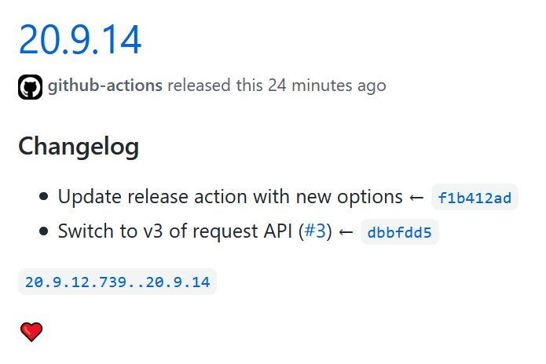

# release-with-changelog



Creates reasonable enough GitHub releases for pushed tags, with the commit log as release body.

The action also has customizable release body, that support markdown, and template fields. See [template](#template) option to see how that works.

By no means is this an action with extensive configurable options except for the ones already provided. But I would love to add some more in the future.

## Usage

``` yml
jobs:
  Release:
    runs-on: ubuntu-latest
    steps:
    - uses: actions/checkout@v2
      with:
        fetch-depth: 50
    - uses: fregante/release-with-changelog@v3
      with:
        token: ${{ secrets.GITHUB_TOKEN }}
```

Or you can customize it further:

``` yml
    - uses: fregante/release-with-changelog@v3
      with:
        token: ${{ secrets.GITHUB_TOKEN }}
        exclude: '^Meta'
        commit-template: '- {title} ← {hash}'
        template: |
          ### Changelog

          {commits}

          {range}

          ❤
```

### Clone depth

The action expects you to do a deep clone of the repository using `actions/checkout@v2` in order to get historical commits. You can use `fetch-depth: 0` for `actions/checkout` action to clone entire repository or have a reasonable number like `100` to fetch the last 100 commits.

## Inputs

### token

Required: [Personal access token](https://docs.github.com/en/github/authenticating-to-github/creating-a-personal-access-token) used to create releases.

### title

Default: `{tag}`

Title for the release being create. Available replacements:

- `{tag}` The tag for which the changelog is being generated.

### template

Default:
``` yml
{commits}

{range}
```

Markdown template to be included in release notes. Available replacements:

- `{commits}` List of commits for this release, see [`commit-template`](#commit-template) below for format of each entry.
- `{range}` A link to diff on GitHub between the last and current release.

### commit-template

Default: `'- {hash} {title}'`

Markdown template for each commit entry in release notes. Available replacements:

- `{title}` A single line title of the commit.
- `{hash}` Abbreviated commit hash, gets linkified automatically in release notes.
- `{url}` Plain link to commit on GitHub.
- `{date}` Date of commit, could be specified in [`date-format`](#date-format).

### exclude

Default: `''` <br>
Example: `'^Meta:'` <br>
Example: `true`

Regex to exclude commits based on their title (don't include the initial and final `/`).

Setting this to `true` will enable the default preset, which may change over time, but is currently: `/^meta|^document|^lint|^refactor|readme|dependencies|^v?\d+\.\d+\.\d+/i`

### tag

Default: _the tag that triggered the workflow run_ or _the latest tag available_

Specific tag for which to generate changelog.

### date-format

Default: `short` <br>
Example: `local` <br>
Example: `%d.%m.%Y`

Format of `{date}` replacement as used by [`git log --date`](https://git-scm.com/docs/git-log#Documentation/git-log.txt---dateltformatgt), as either a keyword or a `strftime` string. More info can be found in [StackOverflow answer](https://stackoverflow.com/questions/7853332/#34778736).

### sort

Default: `desc` <br>
Example: `asc`

Set to `asc` if you want to have changelog printed in reverse order.

### draft

Default: `false` <br>
Example: `true`

Set to `true` if you want to have draft release.

### prerelease

Default: `false` <br>
Example: `true`

Set to `true` if you want to have prerelease instead release.

### skip-on-empty

Default: `false` <br>
Example: `true`

Set to `true` if you want to skip creating the release when all commits are excluded.

## Outputs

### skipped

Will be set to `true` if skip-on-empty is enabled and a release was not created, `false` otherwise.

## Release notes for previous tags/releases

If you already have tags/releases without release notes, delete the empty releases (**not the tags**) and use [vercel/release](https://github.com/vercel/release) to create the release notes for those tags:

```sh
# Unsaved changes might be lost. Push your changes to GitHub before running this
npm install release -g
for tag in $(git tag); do
	git checkout $tag && release;
done
git checkout origin/master
```

## License

[MIT](./license)
